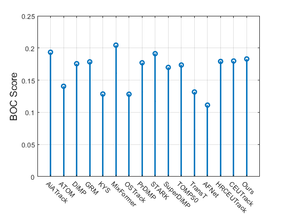
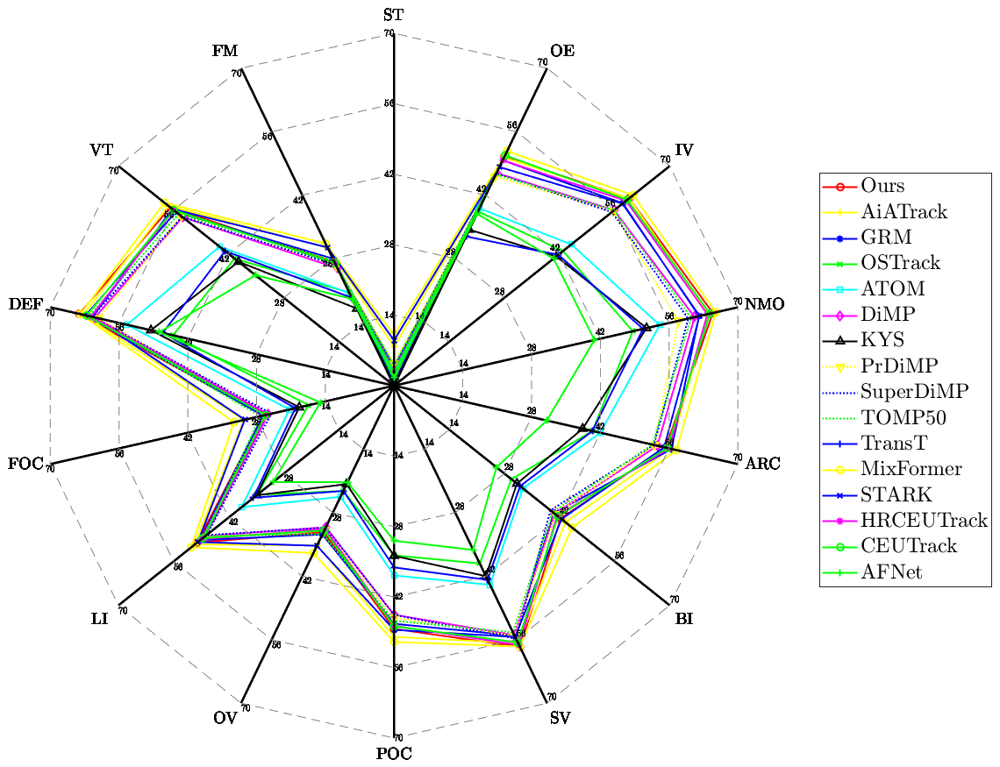

# FELT_SOT_Benchmark 

<div align="center">


  
**The First Frame-Event Long-Term Single Object Tracking Benchmark** 

------

<p align="center">
  • <a href="https://arxiv.org/pdf/2403.05839.pdf">arXiv</a> • 
  <a href="https://github.com/Event-AHU/FELT_SOT_Benchmark">Code</a> •
  <a href="https://youtu.be/6zxiBHTqOhE?si=6ARRGFdBLSxyp3G8">DemoVideo</a> • 
  <a href="">Tutorial</a> •
</p>

</div>

> **Long-term Frame-Event Visual Tracking: Benchmark Dataset and Baseline**, Xiao Wang, Ju Huang, Shiao Wang, Chuanming Tang, Bo Jiang, Yonghong Tian, Jin Tang, Bin Luo, arXiv:2403.05839
[[Paper](https://arxiv.org/pdf/2403.05839.pdf)] 
[[Code](https://github.com/Event-AHU/FELT_SOT_Benchmark)] 
[[DemoVideo](https://youtu.be/6zxiBHTqOhE?si=6ARRGFdBLSxyp3G8)]  


# :dart: Abstract 
Current event-/frame-event based trackers undergo evaluation on short-term tracking datasets, however, the tracking of real-world scenarios involves long-term tracking, and the performance of existing tracking algorithms in these scenarios remains unclear. In this paper, we first propose a new long-term and large-scale frame-event single object tracking dataset, termed FELT. It contains 742 videos and 1,594,474 RGB frames and event stream pairs and has become the largest frame-event tracking dataset to date. We re-train and evaluate 15 baseline trackers on our dataset for future works to compare. More importantly, we find that the RGB frames and event streams are naturally incomplete due to the influence of challenging factors and spatially sparse event flow. In response to this, we  propose a novel associative memory Transformer network as a unified backbone by introducing modern Hopfield layers into multi-head self-attention blocks to fuse both RGB and event data. Extensive experiments on both FELT and RGB-T tracking dataset LasHeR fully validated the effectiveness of our model. 


# :collision: Update Log 

* [2024.03.12] The FELT SOT dataset, baseline, benchmarked results, and evaluation toolkit are all released.
* [2024.03.09] Our arXiv paper is available at [[arXiv](https://arxiv.org/abs/2403.05839)]. 


# :video_camera: Demo Video 
* **The demo video for the FELT SOT dataset is available on** [[**Youtube**](https://youtu.be/6zxiBHTqOhE?si=6ARRGFdBLSxyp3G8)]. 

<p align="center">
  <a href="https://youtu.be/6zxiBHTqOhE?si=6ARRGFdBLSxyp3G8">
    
  </a>
</p>


# :hammer: Environment


## Framework 
<p align="center">

</p>

* **Install environment using conda**
```
conda create -n amttrack python=3.8
conda activate amttrack
bash install.sh
```

* **Run the following command to set paths for this project**
```
python tracking/create_default_local_file.py --workspace_dir . --data_dir ./data --save_dir ./output
```

* **After running this command, you can also modify paths by editing these two files**
```
lib/train/admin/local.py  # paths about training
lib/test/evaluation/local.py  # paths about testing
```

* **Then, put the tracking datasets FELT in `./data`.**

* **Download pre-trained [MAE ViT-Base weights](https://pan.baidu.com/s/1JHLoV-ta10C0pi07-2Si7w?pwd=AHUT) and put it under `$/pretrained_models`**


* **Download the trained model weights from [AMTTrack_ep0050.pth](https://pan.baidu.com/s/19LUsH9mcH_YUDw9PIbDyzw?pwd=AHUT) and put it under `$/output/checkpoints/train/amttrack/amttrack_felt` for test directly.** 

* **[Note]** If you need the event voxel, please use the script [[event_to_voxel_felt.py](https://github.com/Event-AHU/FELT_SOT_Benchmark/blob/main/event_to_voxel_felt.py)] to transform the event point for the voxel. For the construction of baseline trackers (from RGB tracker to RGB-event tracker) to compare, in this benchmark, we fuse the RGB frame and event data using the script [[fusion_rgb_event_image.py](https://github.com/Event-AHU/FELT_SOT_Benchmark/blob/main/fusion_rgb_event_image.py)]. Please check them for more detailed information.


## Train & Test & Evaluation
```
# train
python tracking/train.py --script amttrack --config amttrack_felt --save_dir ./output --mode single --nproc_per_node 1 --use_wandb 0

# test
python tracking/test.py amttrack amttrack_felt --dataset felt --threads 1 --num_gpus 1
```


## Test FLOPs, and Speed
*Note:* The speeds reported in our paper were tested on a single RTX 3090 GPU.


# :dvd: FELT_SOT Dataset 

<p align="center">

</p>

* **BaiduYun:** 
```
FELT: https://pan.baidu.com/s/12ur7n1wSDvIWajPQJMd8Kg?pwd=AHUT
FELT V2：https://pan.baidu.com/s/1AiUTsvvsCKj8lWuc-821Eg?pwd=AHUT...
```

* **DropBox:**
```
FELT: https://www.dropbox.com/scl/fo/0n5m12gt30drsha30hgth/h?rlkey=20mpz2oh1etbv8cnsav01bhj5&dl=0
FELT V2：Coming soon...
```

The directory should have the below format:
```Shell
├── FELT_SOT dataset
    ├── Training Subset (520 videos, 470.23GB)
        ├── dvSave-2022_10_11_19_24_36
            ├── dvSave-2022_10_11_19_24_36_aps
            ├── dvSave-2022_10_11_19_24_36_dvs
            ├── dvSave-2022_10_11_19_24_36.aedat4
            ├── groundtruth.txt
            ├── absent.txt
        ├── ... 
    ├── Testing Subset (222 videos, 194.93GB)
        ├── dvSave-2022_10_11_19_43_03
            ├── dvSave-2022_10_11_19_43_03_aps
            ├── dvSave-2022_10_11_19_43_03_dvs
            ├── dvSave-2022_10_11_19_43_03_dvs.aedat4
            ├── groundtruth.txt
            ├── absent.txt
        ├── ...
```

# :triangular_ruler: Evaluation Toolkit


1. Download the FELT_eval_toolkit from [FELT_eval_toolki (Passcode：AHUT)](https://pan.baidu.com/s/1jZkKQpwP-mSTMnZYO79Z9g?pwd=AHUT), and open it with Matlab (over Matlab R2020).
2. add your tracking results and [baseline results (Passcode：AHUT)](https://pan.baidu.com/s/1bY3ozPUEevjHehmikipbcw?pwd=AHUT)  in `$/felt_tracking_results/` and modify the name in `$/utils/config_tracker.m`
3. run `Evaluate_FELT_benchmark_SP_PR_only.m` for the overall performance evaluation, including SR, PR, NPR.
4. run `plot_BOC.m` for BOC score evaluation and figure plot.
5. run `plot_radar.m` for attributes radar figrue plot.
6.  run `Evaluate_FELT_benchmark_attributes.m` for attributes analysis and figure saved in `$/res_fig/`. 
<p align="center">
  
</p>


# :chart_with_upwards_trend: Benchmark Results 
<p align="center">

</p>

# :cupid: Acknowledgement 
[[CEUTrack](https://github.com/Event-AHU/COESOT)] 
[[VisEvent](https://github.com/wangxiao5791509/VisEvent_SOT_Benchmark)] 
[[FE108](https://github.com/Jee-King/ICCV2021_Event_Frame_Tracking)] 
[[Awesome_Modern_Hopfield_Networks](https://github.com/Event-AHU/Awesome_Modern_Hopfield_Networks)] 
[[OSTrack](https://github.com/botaoye/OSTrack)] 

# :newspaper: Citation 
If you think this project is helpful, please feel free to leave a star ⭐️ and cite our paper:

```bibtex
@misc{wang2024FELTSOT,
      title={Long-term Frame-Event Visual Tracking: Benchmark Dataset and Baseline}, 
      author={Xiao Wang and Ju Huang and Shiao Wang and Chuanming Tang and Bo Jiang and Yonghong Tian and Jin Tang and Bin Luo},
      year={2024},
      eprint={2403.05839},
      archivePrefix={arXiv},
      primaryClass={cs.CV}
}
```


